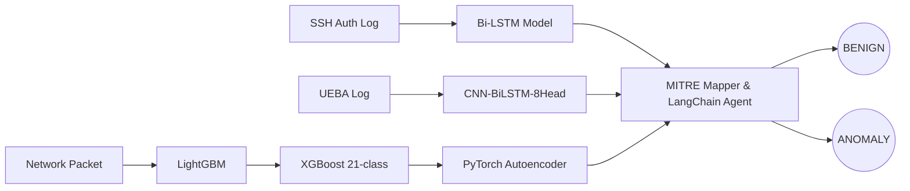

# Redesign Proposal: AI Data Pipeline Visualization

The current visualization in `LiveSimulation.tsx` is very simple: 3 sources (SSH, UEBA, Network) flowing into a single generic "AI Core", and then outputting to BENIGN or ANOMALY. 

Since you are presenting this at a PFE defense, we can make this visualization **much more effective and detailed** by replacing the generic "AI Core" with the *actual* machine learning models and pipelines you built!

## Proposed Visual Architecture

I propose we redesign the Canvas graph to look like this:

### Key Enhancements:
1. **Model-Specific Nodes**: Instead of one "AI Core", the particles will flow into their respective model nodes. SSH traffic will route to the `Bi-LSTM`, UEBA traffic will route to the `CNN-BiLSTM`, and Network traffic will route through a 3-node sequence (`LightGBM` → `XGBoost` → `PyTorch Autoencoder`).
2. **The LangChain Agent Node**: After classification, all threat particles will route into a new node representing the `MITRE Mapper & LangChain Agent` before reaching their final verdict.
3. **Complex Particle Routing**: The WebGL animation will be updated so that particles traverse these specific paths in real-time, waiting briefly at each model node (to simulate processing time). 
4. **Theme-Aware Colors**: The canvas will be updated to respect the Light/Dark mode colors automatically instead of hardcoding dark colors.

## User Review Required

> [!IMPORTANT]
> Because you instructed me not to modify anything until validated, I have prepared this plan for your review. 
> 
> Does this architecture accurately represent the story you want to tell during your defense? If you approve, I will completely rewrite the `NetworkCanvas.tsx` routing engine and geometry to render this complex multi-stage pipeline!
