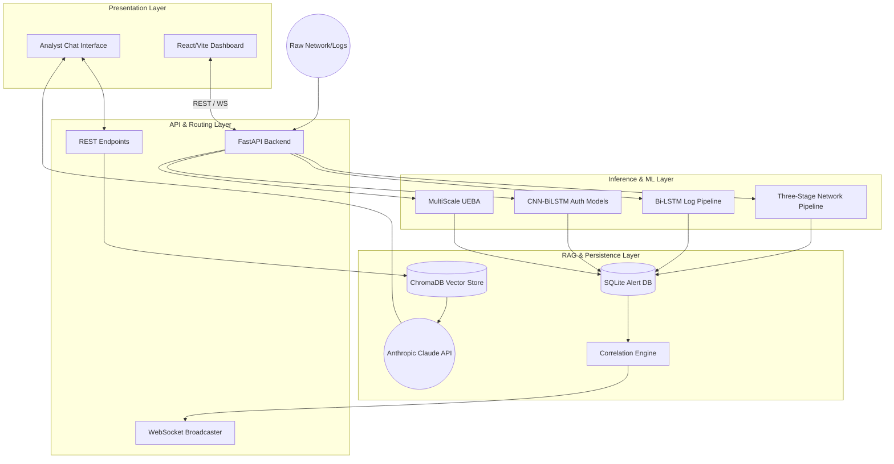
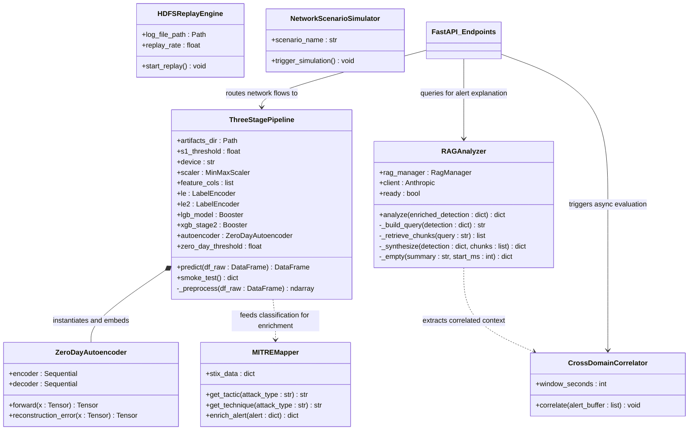
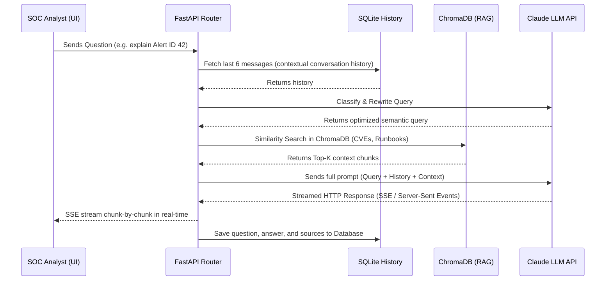

# CyberAI NIDS: Defense Presentation Content

*A comprehensive, evidence-based guide for the jury defense derived directly from the project's codebase, notebooks, and architecture.*

---

## 1. Problem Statement

### What Specific Problem are We Solving?
* **Data Volume & Threat Velocity:** Modern enterprise networks produce millions of security events and log lines per minute. Managing, parsing, and evaluating this massive flow of information in real-time is computationally overwhelming.
* **The Zero-Day Blindspot:** Traditional signature-based Network Intrusion Detection Systems (NIDS) are completely blind to novel, "zero-day" exploits whose threat signatures do not exist in standard databases.
* **Alert Fatigue & Cognitive Load:** Existing IDSes trigger thousands of false positive warnings daily. Security operations centers are flooded with low-risk noise, causing critical, high-risk attacks to go unnoticed.
* **Lack of Remediation Context:** Typical NIDS output is mathematically dry (e.g., an IP address and a vague label like "Anomaly"). Analysts must manually search CVE databases, vulnerabilities, and internal playbooks, wasting valuable containment windows.

### Why Existing Solutions are Insufficient?
* **Signature-Based Engines (Snort, Suricata):** Only flag known patterns. They fail to identify behavioral anomalies or zero-day modifications of known exploits.
* **Flat Supervised Machine Learning Models:** Standard tabular and deep classifiers optimize for global accuracy. When trained on highly imbalanced cybersecurity datasets (e.g., the 83% Benign ratio in CIC-IDS2017), they systematically fail to detect rare attack classes (such as Botnets or SQL injections) because the benign majority dominates the loss function.
* **Order-Agnostic Log Analysis:** Basic log analysis systems parse records line-by-line without analyzing sequence dependencies. In distributed filesystems like HDFS, an anomaly is often not a single bad log line, but rather a normal event occurring in an abnormal, chronological order.
* **Disconnected Investigation Workflows:** Security detection exists in a silo from security analysis. The lack of integrated semantic search and automated mitigation synthesis forces SOC analysts to manually stitch together data from different screens, delaying incident response times.

---

## 2. Proposed Solution

### High-Level Overview of the System
The **CyberAI NIDS** is a hybrid, multi-domain intrusion detection and investigation platform. It splits the detection process into three distinct layers:
1. **Multi-Domain Ingestion:** Consumes network packet flows and system log streams simultaneously.
2. **Decoupled, Hierarchical ML Pipelines:** Segregates high-throughput noise filtering, specific threat classification, and zero-day detection into specialized models, alongside temporal sequence modelers for system logs.
3. **RAG-Powered AI SOC Analyst:** Bridges mathematical anomaly labels and human mitigation actions through semantic vector search and automated incident reports.

```
+-------------------------------------------------------------+
|                     CyberAI NIDS Core                       |
|   Telemetry Ingestion --> ML Filtering --> AI Explanation   |
+-------------------------------------------------------------+
```

### How Our Idea Works
* **The Three-Stage Network Pipeline:**
  * **Stage 1 (LightGBM Binary Gate):** An ultra-fast gradient-boosted decision tree evaluates network packets in less than 0.5ms per flow. It blocks 99% of normal traffic and optimizes for maximum *Recall* to ensure zero attacks are missed.
  * **Stage 2 (XGBoost Multiclass Classifier):** Runs *only* on traffic flagged as malicious by Stage 1. Because it is trained exclusively on attack flows, it avoids benign class bias and accurately attributes threats to 8 specific attack categories.
  * **Stage 3 (PyTorch Autoencoder Zero-Day Detector):** A deep neural network trained only on known attack profiles. If a flagged threat exhibits a high reconstruction error (exceeding the 95th percentile), the system overrides the classification and flags the flow as a **ZERO_DAY** threat.
* **Log Sequence Pipeline:** A Bidirectional LSTM model monitors HDFS log sequences. It evaluates log sequences forwards and backwards to detect logical event order anomalies.
* **Cross-Domain Correlation Engine:** A background process scans alerts in a rolling 300-second window, linking related network, HDFS, and system anomalies into unified, critical meta-incidents.
* **Retrieval-Augmented Generation (RAG):** The AI Analyst pulls historical playbooks and CVE details from ChromaDB to deliver natural-language mitigations to the analyst.

### How Does it Solve the Problem?
* **Eliminates Blindspots:** PyTorch autoencoders mathematically flag zero-day variations that signature engines miss.
* **Defeats Alert Fatigue:** Fast tree-based filters drop benign noise instantly. The correlation engine groups hundreds of packets into a single critical incident.
* **Solves the Imbalance Dilemma:** Splitting detection into a binary gate and an attack-only attribution model prevents the benign majority class from drowning out rare attack signatures.
* **Minimizes Response Times:** The RAG-assisted assistant provides natural language root causes and mitigation instructions instantly, cutting analysis time from hours to seconds.

---

## 3. System Architecture - Overview Diagram

*The complete data flow of the platform, showing decoupling between presentation, inference, database, and generative AI services.*



---

## 4. System Architecture - Use Case Diagram

*A detailed UML-compliant Use Case Diagram showing the interactions of multiple roles (SOC Analyst, Security Administrator, and AI Researcher) with sub-modules of the CyberAI NIDS platform, along with include/extend relationships and external system interfaces.*

```mermaid
graph TB
    %% Actors
    subgraph Human_Actors ["👥 Human Roles"]
        Analyst["👤 SOC Analyst<br/>(Primary Investigator)"]
        Admin["⚙️ Security Administrator<br/>(System Operator)"]
        Researcher["🔬 AI Researcher / ML Eng<br/>(Model Auditor)"]
    end

    subgraph System_Actors ["🤖 System & External Interfaces"]
        Ingestor["📡 Telemetry Source<br/>(Network & Log Ingestion)"]
        Claude["🧠 Claude LLM API<br/>(Generative Explainer)"]
        Databases["💾 System Storage<br/>(SQLite / ChromaDB)"]
    end

    subgraph Platform ["🛡️ CyberAI NIDS Platform"]
        
        %% Sub-Module: Dashboard & Monitoring
        subgraph Mod_Monitor ["Live Monitoring Module"]
            UC_MonitorDashboard("Monitor Live Alerts Dashboard")
            UC_ReceiveAlertBroadcast("Receive WebSocket Alert Broadcasts")
            UC_FilterAlerts("Filter/Search Alerts by Severity")
        end

        %% Sub-Module: Threat Deep-Dive
        subgraph Mod_Investigation ["Threat Investigation & Explainability"]
            UC_InvestigateAlert("Investigate Alert Details")
            UC_InspectShap("Inspect SHAP Feature Weights")
            UC_ReviewMitre("Review MITRE ATT&CK Mapping")
            UC_RequestReport("Request AI Incident & Mitigation Report")
        end

        %% Sub-Module: AI Agent
        subgraph Mod_Analyst ["AI Agent & Conversation Module"]
            UC_ChatBot("Interact with AI Analyst Chatbot")
            UC_QueryRAG("Query ChromaDB Vector Store")
            UC_FetchHistory("Retrieve Contextual Chat History")
            UC_StreamClaude("Stream LLM Explanations")
        end

        %% Sub-Module: Simulation
        subgraph Mod_Simulation ["Simulation & Validation Module"]
            UC_RunSimulations("Run Scenario Simulations")
            UC_InjectNetwork("Inject Synthetic Network Attack Flows")
            UC_ReplayHDFS("Replay Chronological HDFS Log Blocks")
        end

        %% Sub-Module: Model Performance & Tuning
        subgraph Mod_ModelPerf ["Model Auditing & Config Module"]
            UC_AuditMetrics("Compare & Audit Model Metrics")
            UC_ReviewThresholds("Adjust Model Confidence Thresholds")
            UC_InspectCurves("Inspect Validation ROC & Confusion Curves")
            UC_ManageSystem("Manage Ingestion & DB States")
            UC_ClearDB("Clear SQLite Alert / Incident DB")
        end
    end

    %% Actor to Use Case Associations
    Analyst --> UC_MonitorDashboard
    Analyst --> UC_InvestigateAlert
    Analyst --> UC_ChatBot
    Analyst --> UC_RunSimulations

    Admin --> UC_RunSimulations
    Admin --> UC_ManageSystem

    Researcher --> UC_AuditMetrics
    Researcher --> UC_ReviewThresholds

    %% Include / Extend Relationships
    UC_ReceiveAlertBroadcast -.->|"<<extend>>"| UC_MonitorDashboard
    UC_FilterAlerts -.->|"<<extend>>"| UC_MonitorDashboard

    UC_InvestigateAlert -.->|"<<include>>"| UC_InspectShap
    UC_InvestigateAlert -.->|"<<include>>"| UC_ReviewMitre
    UC_InvestigateAlert -.->|"<<include>>"| UC_RequestReport

    UC_ChatBot -.->|"<<include>>"| UC_QueryRAG
    UC_ChatBot -.->|"<<include>>"| UC_FetchHistory
    UC_ChatBot -.->|"<<include>>"| UC_StreamClaude

    UC_RunSimulations -.->|"<<include>>"| UC_InjectNetwork
    UC_RunSimulations -.->|"<<include>>"| UC_ReplayHDFS

    UC_AuditMetrics -.->|"<<include>>"| UC_InspectCurves
    UC_ManageSystem -.->|"<<extend>>"| UC_ClearDB

    %% Use Case to System Interfaces Connections
    UC_ReceiveAlertBroadcast <--> Ingestor
    UC_RequestReport --> Claude
    UC_RequestReport <--> Databases
    
    UC_QueryRAG <--> Databases
    UC_StreamClaude --> Claude
    
    UC_InjectNetwork --> Ingestor
    UC_ReplayHDFS --> Ingestor
    
    UC_ClearDB --> Databases

    %% Color Theme Styling (3Blue1Brown inspired dark styling)
    classDef human fill:#1A1A2E,stroke:#5B8BF5,stroke-width:2px,color:#E0E0E0;
    classDef system fill:#0D0D1A,stroke:#FF5A5F,stroke-width:2px,color:#E0E0E0;
    classDef usecase fill:#1A1A2E,stroke:#FDDB6D,stroke-width:1.5px,color:#E0E0E0;
    classDef includeExtend fill:none,stroke:#888888,stroke-dasharray: 5 5;

    class Analyst,Admin,Researcher human;
    class Ingestor,Claude,Databases system;
    class UC_MonitorDashboard,UC_ReceiveAlertBroadcast,UC_FilterAlerts,UC_InvestigateAlert,UC_InspectShap,UC_ReviewMitre,UC_RequestReport,UC_ChatBot,UC_QueryRAG,UC_FetchHistory,UC_StreamClaude,UC_RunSimulations,UC_InjectNetwork,UC_ReplayHDFS,UC_AuditMetrics,UC_ReviewThresholds,UC_InspectCurves,UC_ManageSystem,UC_ClearDB usecase;

    %% Styling specific subgraphs
    style Platform fill:#0D0D1A,stroke:#5B8BF5,stroke-width:1px;
    style Human_Actors fill:#0D0D1A,stroke:#5B8BF5,stroke-width:1px;
    style System_Actors fill:#0D0D1A,stroke:#FF5A5F,stroke-width:1px;
```




---

## 5. System Architecture - Detailed Class Diagram

*Backend static structure detailing properties and methods of main Python classes in the pipeline and the relationships between components.*



---

## 6. System Architecture - Chatbot Sequence Diagram

*Dynamic workflow showcasing how user queries map to conversational histories, retrieval collections, LLM prompts, and Server-Sent Event (SSE) responses.*



---

## 7. Datasets Used & Selection Rationale

### Network Flows: CIC-IDS2017
* **Composition:** Contains 2.3 million network flow samples capturing realistic background traffic alongside modern network exploits.
* **Attack Profiles:** Covers DoS (Hulk, GoldenEye, slowloris), DDoS, PortScan, SSH-Patator (SSH brute-force), FTP-Patator (FTP brute-force), Botnets, and Web Exploits (XSS, SQL injection).
* **Rationale for Choice:** It is the benchmark standard for NIDS. Unlike old synthetic sets (like KDD99), it contains real network flow features (packet lengths, inter-arrival times, TCP flags) and preserves the natural class imbalance (~83% benign, 17% attack), mirroring real-world deployment challenges.

### System Logs: HDFS_v1 (LogHub)
* **Composition:** Derived from Hadoop Distributed File System cluster logs, totaling 578,809 labeled block sessions (normal vs. anomalous).
* **Anomaly Profile:** Captures replication failures, block write issues, write timeouts, node failures, and structural filesystem anomalies.
* **Rationale for Choice:** HDFS log entries are structured by sequential `block_id` sessions, providing an excellent template database to evaluate sequential RNN classifiers. Because anomalies are logical sequences of events, it is ideal for testing time-series dependency models.

---

## 8. Notebook Analysis & Preprocessing Pipeline

*Detailed execution review of the preprocessing notebooks:* [cyberai-three-stage.ipynb](file:///c:/Users/artub/OneDrive/Bureau/CyberAi_project/cyberai-nids/notebook/cyberai-three-stage.ipynb) *and* [cyberai-hdfs (1).ipynb](file:///c:/Users/artub/OneDrive/Bureau/CyberAi_project/cyberai-nids/notebook/cyberai-hdfs%20(1).ipynb).

### 1. Log Parsing & Preprocessing (HDFS Logs)
* **The "Infinite Vocabulary" Problem:** System logs contain highly dynamic values (timestamps, block IDs, IP addresses, session IDs) that change on every line, making direct text analysis impossible.
* **Drain-Inspired Parser:** We implement a regex parser that replaces dynamic variables with a `<*>` placeholder, collapsing millions of raw strings into a stable vocabulary of **58 event templates**.
* **Concrete Example:**
  * *Raw Log line:*
    `2008-11-09 20:36:02 INFO dfs.DataNode$PacketResponder: PacketResponder 1 for block blk_-160899 terminating`
  * *Parsed Event Template:*
    `PacketResponder <*> for block BLK terminating`

### 2. Feature Engineering
* **For HDFS Logs:**
  * *Sequence Modeling:* Parsed event templates are grouped by `block_id` to form chronological sequence histories. These are integer-encoded and padded/truncated to a fixed shape for deep learning.
  * *Frequency Modeling:* For the Random Forest baseline, event counts are structured into frequency vectors of shape `[557809, 58]`.
* **For Network Flows (CIC-IDS2017):**
  * *Cleaning:* Infinities are converted to NaNs, missing values are imputed, and duplicates are dropped.
  * *Class Grouping:* Rare classes (Infiltration, Heartbleed) are merged into a "Rare Attack" category. DoS/Web subtypes are grouped to create statistically robust targets for SMOTE balancing.
  * *Scaling:* Standardization is fit strictly on training splits to prevent data leakage.

### 3. Data Leakage Prevention
* A strict **5% inference set** (111,591 flows) is carved out *before* scaling, oversampling (SMOTE), or class balancing.
* Scalers and SMOTE are fit *strictly on training splits* to guarantee unbiased evaluation on unseen data.

### 4. Models and Algorithms Used
* **LightGBM (Stage 1 Binary Gate):** Extreme speed (<0.5ms/flow), native support for class imbalance. Optimizes for Recall.
* **XGBoost (Stage 2 Multiclass Classifier):** Trained *exclusively* on attack data to classify specific exploit categories.
* **PyTorch Autoencoder (Stage 3 Zero-Day Detector):** Unsupervised neural network with 16-dimension bottleneck. Reconstruction threshold is set at the 95th percentile.
* **Bidirectional LSTM (HDFS Log Classifier):** RNN that evaluates sequences forward and backward to capture chronological dependencies.

### 5. Results & Evaluation Metrics
* primary metrics are **Macro F1-Score** and **Recall** due to class imbalances.
* **HDFS Logs:**
  * *Random Forest baseline:* Precision 0.9906, Recall 0.9988, F1 0.9947, ROC-AUC 1.0000.
  * *Bidirectional LSTM:* Precision 0.9732, Recall 0.9994, F1 0.9861, ROC-AUC 1.0000.
* **Network Inference Simulation:**
  * Binary Detection Accuracy: 0.9983, Macro F1: 0.9967, Zero-day flag rate: 0.76%.
  * Stage 2 Attack Multiclass Isolated F1: 0.9656.

### Why These Choices Were Made
* Sequential pipelines combine speed (LightGBM) with accuracy (XGBoost) and novelty detection (Autoencoders), minimizing computational latency (only flagged malicious packets trigger heavy neural networks).
* Bidirectional LSTMs capture temporal contexts which tree-based frequency vectors miss.

---

## 9. Conclusion

### Problem Recap
Enterprise security teams suffer from severe alert fatigue caused by legacy signature engines. These engines generate thousands of false positive logs, fail completely on unknown zero-day attacks, and lack human-readable context for threat remediation.

### Solution Recap
The **CyberAI NIDS** introduces a hierarchical, decoupled detection architecture. It utilizes a fast binary gate ([LightGBM](file:///c:/Users/artub/OneDrive/Bureau/CyberAi_project/cyberai-nids/backend/network_pipeline.py#L103)) for noise reduction, a multiclass classifier ([XGBoost](file:///c:/Users/artub/OneDrive/Bureau/CyberAi_project/cyberai-nids/backend/network_pipeline.py#L106)) for specific attribution, a PyTorch [Autoencoder](file:///c:/Users/artub/OneDrive/Bureau/CyberAi_project/cyberai-nids/backend/network_pipeline.py#L47) for zero-day identification, a [Bi-LSTM](file:///c:/Users/artub/OneDrive/Bureau/CyberAi_project/cyberai-nids/notebook/cyberai-hdfs%20(1).ipynb) for log order dependencies, and a ChromaDB + Claude LLM RAG agent ([RAGAnalyzer](file:///c:/Users/artub/OneDrive/Bureau/CyberAi_project/cyberai-nids/backend/rag_analyzer.py#L39)) to automate vulnerability containment.

### Main Achievements
* **Zero-Day Detection:** Successfully isolated novel, unseen attacks based on reconstruction errors above the 95th percentile.
* **Defeated Class Imbalance:** Isolated benign traffic from attack attribution, boosting rare class F1 performance.
* **Alert Sequence Understanding:** Proved that Bidirectional LSTMs can model chronological system logs with high accuracy (0.9861 F1).
* **Actionable SOC Intelligence:** Integrated RAG vector searches to translate mathematical anomalies into immediate incident response reports.

---

## 10. Questions & Answers

### Q1: Why use a Three-Stage pipeline instead of one deep multiclass model?
* **Answer:** A single classifier faces extreme class imbalance (Benign is 83% of CIC-IDS2017) and will ignore rare attacks to optimize overall accuracy. By isolating normal traffic at Stage 1, Stage 2 trains *only* on malicious anomalies. This boosts multiclass F1 scores. Crucially, a supervised model cannot flag zero-days, which is why the unsupervised Stage 3 Autoencoder is required.

### Q2: How did you ensure your model isn't "cheating" through Data Leakage?
* **Answer:** We enforced strict validation boundaries. A 5% inference set was isolated before any preprocessing. The MinMaxScaler and SMOTE oversamplers were fit *strictly* on the remaining training folds. If SMOTE was applied before splitting, synthetic data from the training set would leak into validation, causing artificially high (0.999) scores.

### Q3: Why replace IDs and IP addresses with `<*>` during log preprocessing?
* **Answer:** System logs contain highly dynamic parameters (IPs, session keys, block IDs) that change on every line. Without normalisation, the text encoder's vocabulary size becomes infinite, causing model overfitting and failure. The Drain-inspired parser collapses this dynamic noise into 58 distinct, static templates, allowing the LSTM to focus on the logical sequence.

### Q4: How does the RAG Agent improve incident containment times?
* **Answer:** Typical IDSes output raw labels like "DoS GoldenEye". A Tier-1 analyst then spends 30 minutes reading playbooks, searching CVEs, and writing reports. The [RAGAnalyzer](file:///c:/Users/artub/OneDrive/Bureau/CyberAi_project/cyberai-nids/backend/rag_analyzer.py#L39) takes the prediction, queries ChromaDB for MITRE playbooks, sends it to the Claude LLM API, and generates a mitigation report instantly, converting manual incident response into a simple checklist.
